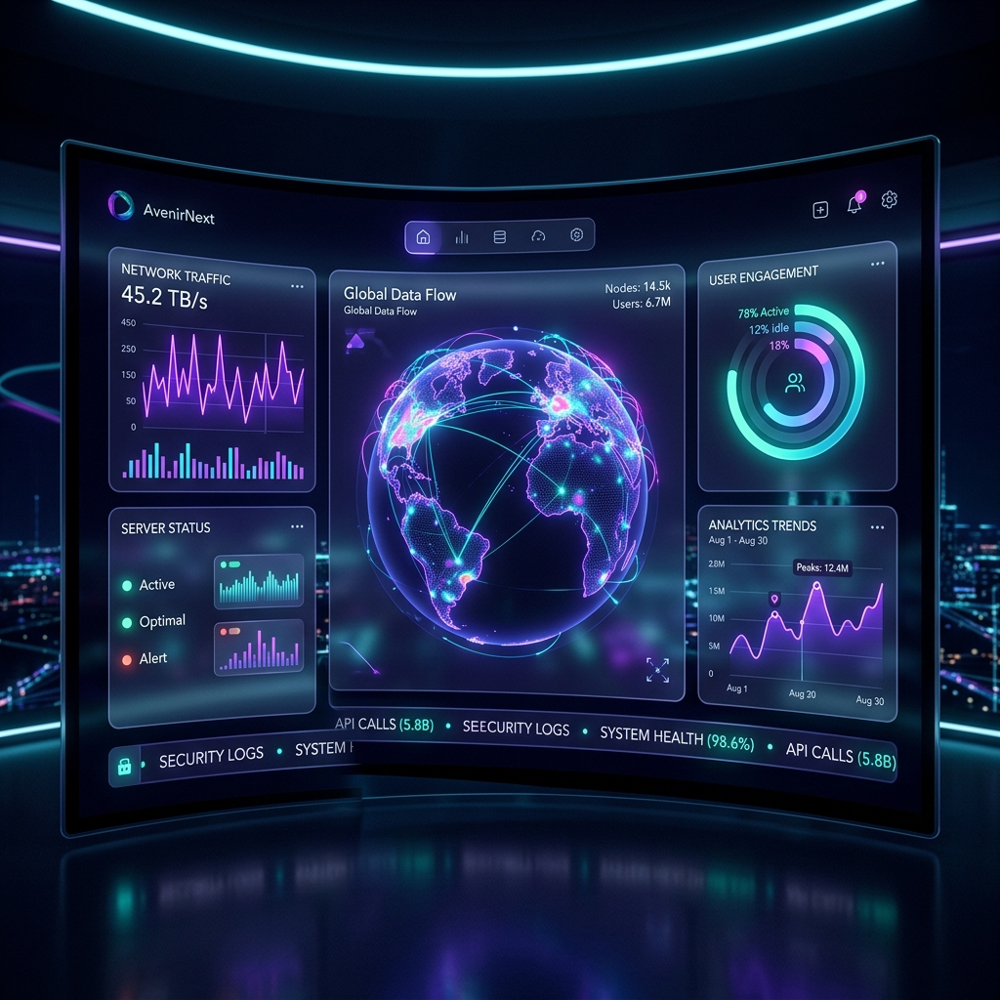

# 🌌 DevFlow: Quantum Productivity Intelligence
### *Mastering the Software Development Life Cycle with Precision & Insight*

### [🌐 Live Intelligence Dashboard](https://burgerbeast7.github.io/DevFlow-Developer-Productivity-MVP)

---

#### Crafted with ❤️ by **[Kunal Chauhan](https://github.com/burgerbeast7)**
*Transforming raw metrics into engineering excellence.*

## 🚀 The Vision
**DevFlow** is more than a dashboard—it's a narrative engine for the modern engineer. In a world of overwhelming data, DevFlow distills complex SDLC signals into clear, actionable stories. It helps developers like **Ava Chen** find the "Signal in the Noise," identifying exactly where execution speed meets release friction.

## 💎 Elite Features
- **🔮 Predictive Interpretation**: An AI-powered logic engine that correlates Lead Time and Cycle Time to uncover hidden system bottlenecks.
- **✨ Glassmorphism Interface**: A high-fidelity, futuristic UI designed for the elite developer aesthetic.
- **⚡ Real-Time Data Gravity**: Seamlessly integrates data from Jira, GitHub, and CI/CD pipelines via a high-performance Node.js backend.
- **🛡️ Quality Sentinel**: Monitors Escaped Bug Rates and Deployment Frequency to ensure speed never sacrifices stability.

## 📊 Core Intelligence (Assignment Metrics)
| Metric | Purpose | Vector |
| :--- | :--- | :--- |
| **Lead Time** | PR Open ➔ Prod Success | Velocity Efficiency |
| **Cycle Time** | In-Progress ➔ Done | Execution Speed |
| **PR Throughput** | Merged Volume per Month | Output Density |
| **Deploy Freq** | Continuous Delivery Pulse | System Agility |
| **Bug Rate** | Escaped Issues / Completed | Quality Integrity |

## 🛠️ The Tech Arcanum
- **Frontend**: React 18, Vite (Fractal Component Architecture)
- **Styling**: Vanilla CSS (Cyber-Minimalist Design System)
- **Visualization**: Recharts (Dynamic Trend Analysis)
- **Engine**: Node.js & Express (Asynchronous Data Serving)
- **Data Alchemy**: Python & Pandas (Automated Workbook Extraction)

## 🧠 Responsible AI Synthesis
DevFlow was built using an advanced human-AI symbiotic workflow:
- **Architecture**: AI-modeled data relations for optimal PR-to-Deployment linking.
- **Design**: Cyber-Indigo color palette algorithmically refined for visual focus.
- **Verification**: Logic-checked against strict SDLC metric definitions from the assignment brief.

---

## 📂 Core Systems Navigation
*Quick access to the architectural spine of DevFlow:*

- **[Quantum Logic (Metrics Engine)](src/utils/metrics.js)**: The mathematical core of the application.
- **[Intelligence Interface (Dashboard)](src/App.jsx)**: The primary React interface.
- **[Neural API (Backend)](server/server.cjs)**: The data serving layer.
- **[Data Alchemy (Extraction Script)](extract_data.py)**: Automated workbook-to-JSON pipeline.

## ⚡ Quick Ignition
1. **Calibrate**: `npm install`
2. **Ignite**: `npm run dev`
3. **Orbit**: Port `5175` (Frontend) & `3001` (Neural API)

---

  
<i>The future of developer productivity isn't more data. It's more understanding.</i>

  

